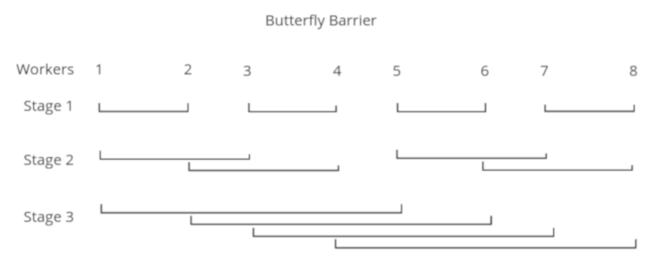
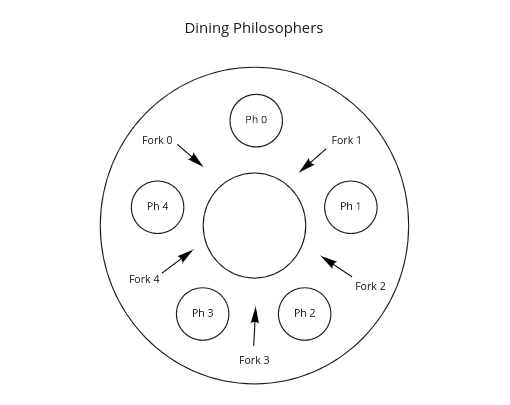

# Módulo II

:dart: **Clases 3 a 6:** *Concurrencia con memoria compartida*

- [Módulo II](#módulo-ii)
  - [Locks & Barriers](#locks--barriers)
    - [El problema de la Sección Crítica](#el-problema-de-la-sección-crítica)
    - [Barreras (barriers)](#barreras-barriers)
  - [Implementaciones con Variables Compartidas](#implementaciones-con-variables-compartidas)
    - [Para Secciones Críticas](#para-secciones-críticas)
      - [Spin Locks](#spin-locks)
      - [Soluciones Fair](#soluciones-fair)
        - [Tie Breaker](#tie-breaker)
        - [Ticket](#ticket)
      - [Bakery](#bakery)
    - [Para Barreras](#para-barreras)
      - [Shared Counter](#shared-counter)
      - [Flags & Coordinators](#flags--coordinators)
        - [Principio de sincronización por banderas](#principio-de-sincronización-por-banderas)
      - [Tree Barrier](#tree-barrier)
    - [Barrerar simétricas](#barrerar-simétricas)
      - [Butterfly](#butterfly)
      - [Dissemination Barrier](#dissemination-barrier)
    - [Defectos](#defectos)
  - [Implementaciones con Semáforos](#implementaciones-con-semáforos)
    - [Sintáxis y semántica](#sintáxis-y-semántica)
      - [Para secciones críticas](#para-secciones-críticas-1)
      - [Para Barriers](#para-barriers)
    - [Problemas y Técnicas](#problemas-y-técnicas)
      - [Productores y consumidores: Split Binary Semaphore (SBS)](#productores-y-consumidores-split-binary-semaphore-sbs)
      - [Búffers limitados: Contadores de recursos](#búffers-limitados-contadores-de-recursos)
      - [Dining Philosophers y lectores/escritores: Exlusión mutua selectiva](#dining-philosophers-y-lectoresescritores-exlusión-mutua-selectiva)
      - [Lectores y escritores: Exclusión mutua selectiva](#lectores-y-escritores-exclusión-mutua-selectiva)
      - [Lectores y escritores: Passing the batton](#lectores-y-escritores-passing-the-batton)
  - [Apéndice](#apéndice)
    - [Instrucciones máquina](#instrucciones-máquina)
      - [Fetch and Add (FA)](#fetch-and-add-fa)
      - [Test and Set (TS)](#test-and-set-ts)

## Locks & Barriers

Los programas concurrentes emplean dos tipos básicos de sincronización: exclusión mutua y sincronización por condición. Este capítulo examina 2 (dos) problemas importantes (**_secciones críticas_** y **_barreras_**).

El problema de la **_sección crítica_** se preocupa en implementar acciones atómicas por software. Este problema surge en la mayoría de los programas concurrentes, donde, la exclusión mutua es implementada mediante **_locks_** que protegen las secciones críticas.

Una barrera (**_barrier_**), es un punto de sincronización al que todos los procesos deben llegar, antes de que cualquier proceso se le permita proceder. Es un problema muy común en los programas paralelos.

### El problema de la Sección Crítica

En este problema, _n_ procesos repetidamente ejecutan secciones críticas y no cŕiticas de código. La sección crítica está precedida por un **_protocolo de entrada_** y seguida por un **_protocolo de salida_**. Los procesos que contengan secciones críticas, deberían ser de la siguiente forma.

```
Process SeccionCritica[i = 1 to n]
   while (true)
      # entry protocol
      # critical section
      # exit protocol
      # noncritical section
   end;
end;
```

Cada sección crítica, es un conjunto de sentencias que acceden a algún recurso compartido. Mientras que, cada sección no crítica es otra secuencia de instrucciones. Para resolver este problema, es necesario implementar protocolos de entrada y salida que cumplan las siguiente 4 (cuatro) propiedades:

1. **Exclusión mutua:** A lo sumo un proceso podrá estar ejecutando su sección crítica. Esta es una propiedad dentro de la categoría de seguridad. Donde lo malo que puede ocurrir es que dos, o más, procesos accedan a su sección crítica.
   
2. **Ausencia de deadlock:** Si dos o más procesos intentan entrar a sus secciones críticas,al menos uno tendrá éxito. Esta es una propiedad dentro de la categoría de seguridad. Donde lo malo que puede ocurrir es que todos los procesos estén esperando ingresar pero, ninguno sea capaz de lograrlo.
   
3. **Ausencia de demoras inecesarias:** Si un proceso intenta ingresar a su sección crítica y los demás procesos se encuentran ejecutando sus secciones no críticas o finalizaron, el primer proceso no debe estar impedido de ingresar a su sección crítica. Esta es una propiedad dentro de la categoría de seguridad. Donde lo malo que puede ocurrir es que; un proceso no pueda ingresar a su sección crítica aunque no haya procesos en sus secciones críticas.

4. **Eventual entrada:** Todo procesos que intente ingresar a su sección crítica, eventualmente lo logrará. Esta es una propiedad dentro de la categoría de vida y es afectada directamente por la política de scheduling.

:bulb: Cualquier solución al problema de la sección crítica, también puede ser utilizada para implementar sentencias await arbitrarias.

### Barreras (barriers)

Varios problemas pueden ser resueltos utilizando algoritmos iterativos que sucesivamente computen aproximaciones a la respuesta. Terminando cuando la respuesta final haya sido procesada, o bien, haya convergido.

La idea es utilizar múltiples procesos, para procesar partes disjuntas de una solución en paralelo. La clave principal en la mayoría de los algoritmos paralelos, es que cada iteración depende del resultado de una iteración previa. Así, podemos llegar a la siguiente forma general para todo algoritmo que implemente barreras.

```
Process Worker[i = 1 .. n]
   while (true)
      # Realiza la tarea i
      # Espera por los demás procesos
   end;
end;
```

Esto es llamado sincronización por barrera, porque la demora al final de cada iteración representa una barrera a la cual todos los procesos deben llegar, antes de que a cualquier otro se le permita continuar.

## Implementaciones con Variables Compartidas

La sincronización, en esta sección, será implementada mediante la técnica de **_busy waiting_**. Donde un proceso evalúa, repetidas veces, una condición hasta que esta se vuelva verdadera.

:white_check_mark: Puede ser implementada utilizando solo instrucciones de máquina disponibles es cualquier procesador moderno.

:x: Ineficiente en arquitecturas monoprocesador. Pero, puede ser adecuada si cada proceso se ejecuta en su propio procesador.

### Para Secciones Críticas

#### Spin Locks

Solución de grano fino que utiliza instrucciones atómicas especiales, existentes en la mayoría de los procesadores. Por ejemplo, **_Test and Set (TS)_**. Se dice que los procesos dan “vueltas” (spinning) hasta que se libere lock.

```
bool lock = false;

Process CS[i = 1 to n]
   while (true)
      while (TS(lock)) skip;    # Entry
      # Critical Section
      lock = false;             # Exit
      # Noncritical Section
   end;
end;
```

|                    |              Propiedad               |                                              Observación                                              |
| :----------------: | :----------------------------------: | :---------------------------------------------------------------------------------------------------: |
| :white_check_mark: |         **Exclusión mutua**          |                                                   -                                                   |
| :white_check_mark: |       **Ausencia de deadlock**       |                                                   -                                                   |
| :white_check_mark: | **Ausencia de demoras innecesarias** |                                                   -                                                   |
|        :x:         |         **Eventual entrada**         | Solo con **schedulers fuertemente fairs**, ya que `lock` se vuelve verdadera con infinita frecuencia. |
|        :x:         |             Prioridades              |                  No controla el orden en que los procesos demorados, entran a su SC.                  |

#### Soluciones Fair

En esta sección se abordan los algoritmos; **_tie breaker_**, **_ticket_** y **_bakery_**. Estos cumplen las 4 propiedades y solo dependen únicamente de schedulers débilmente fair (como por ejemplo, round robin). También realizan un manejo de prioridades.

##### Tie Breaker

Este algoritmo asegura la exclusión mutua mediante dos variables, una por proceso, `in1` e `in2`. En caso de que ambas valgan verdadero (empate) emplea una variable adicional, `last`, para determinar cuál fue el último en ingresar a su sección crítica.

```
bool in1, in2 = false;
int last = 1;

Process CS1
    while (true)
        last = 1; in1 = true; # Entry
        while (in2 and last == 1) skip;
        # Critical Section
        in1 = false; #Exit
        # Noncritical Section
    end;
end;

Process CS2
    while (true)

        last = 2; in2 = true; # Entry
        while (in1 and last == 2) skip;
        # Critical Section
        in2 = false; # Exit
        # Noncritical section
    end;
end;
```


|                    |                     Característica                      |
| :----------------: | :-----------------------------------------------------: |
| :white_check_mark: |          No requiere instrucciones especiales.          |
| :white_check_mark: | Prioriza al primero en iniciar el protocolo de entrada. |
|        :x:         |          Dificil generalizarlo a _n_ procesos.          |


##### Ticket

El algoritmo ticket, es una solución al problema de la sección crítica generalizada para n procesos, fácil de entender e implementar. El algoritmo se basa en la entrega de tickets (números) a procesos y posteriormente atenderlos en orden de llegada.

Para esto, obligatoriamente, se requiere de alguna instrucción especial que entregue e incremente  los números a cada proceso de forma atómica, para evitar duplicados. Esta instrucción puede ser **_Fetch and Add_**. De no existir una instrucción máquina del tipo FA, se puede reemplazar con otra sección crítica.

```
int number = 1; next = 1; turn[n] = ([n] 0);

Process WithFA [i = 1 .. n]
    
    turn[i] = FA(number, 1);
    
    while (turns[i] != next) skip;  # Entry
    # Critical Section
    next = next + 1;                # Exit
    
    # Noncritical Section
end;

Process WithoutFA [i = 1 .. n]
    
    turn[i] = number;               # Reemplazo FA
    < number = number + 1 >         # Reemplazo FA
    
    while (turns[i] != next) skip;  # Entry
    # Critical Section
    next = next + 1;                # Exit
    # Noncritical Section
end;

```

|                    |                                                    Característica                                                     |
| :----------------: | :-------------------------------------------------------------------------------------------------------------------: |
| :white_check_mark: |                                          Sencillo y general a _n_ procesos.                                           |
|        :x:         |                                           Requiere instrucciones especiales                                           |
|        :x:         | La implementación sin FA, u otra, puede entregar números repetidos. Decrementando el grado de justicia del algoritmo. |

#### Bakery

Al igual que en el algoritmo ticket, los procesos obtienen un número y esperan a ser atendidos. La diferencia radica en que en el algoritmo bakery, cada proceso debe revisar el número de los demás para obtener uno mayor a todos los que se encuentran demorados.


```
int turn[n] = ([n] 0);

Process SC [i = 1 .. n]
    while (true)
        
        turn[i] = 1; turn[i] = max(turn) + 1;
        
        for (j = 1 to n st j != i)                              # Entry
            while (turn[j] != 0 and turn[i] > turn[j]) skip;    # Entry
        
        # Critical Section
        
        turn[i] = 0;                                            # Exit
        
        # Noncritical Section
    end;
end;
```

|                    |            Característica             |
| :----------------: | :-----------------------------------: |
| :white_check_mark: | No requiere instrucciones especiales. |
|        :x:         | Calcular el máximo entre _n_ valores  |

### Para Barreras

#### Shared Counter

La manera más sencilla de especificar una barrera, es la de utilizar un contador compartido iniciado en 0. 

Asumiendo que existan n procesos que necesitan reunirse en un barrera. Cuando un proceso llega a la barrera, incrementa el contador; cuando el contador valga _n_, todos los procesos podrán continuar.

```
int count = 0;

Process Worker[i = 1 .. n]
    while (true)
        # Realizar tarea.
        FA(count, 1);
        while (count != n) skip;
    end;
end;
```

|                    |               Característica               |                                                             Observación                                                             |
| :----------------: | :----------------------------------------: | :---------------------------------------------------------------------------------------------------------------------------------: |
|        :x:         |               Poco adecuado                | `count` debe ser reiniciada cuando todos crucen la barrera y, por sobre todo, antes de que cualquier proceso intente incrementarla. |
|        :x:         |     Requiere instrucciones especiales      |                                                                  -                                                                  |
|        :x:         | Requiere administración eficiente de caché |                         `count` es referenciada varias veces. Esto puede provocar **_memory contention_**.                          |
| :white_check_mark: |          Útil con un _n_ pequeño           |                                                                  -                                                                  |

:bulb: Simple y razonable cuando exista un _n_ pequeño y una instrucción especial, del estilo Fetch and Add.

#### Flags & Coordinators

El algoritmo utiliza dos arreglos como **_flags_**; el primero para marcar la llegada de cada proceso a la barrera, y el segundo para indicar a cada proceso que puede continuar. Este último arreglo es actualizado por un proceso **_coordinador_**.

```
int arrive[n] = ([n] 0);
int continue[n] = ([n] 0);

Process Worker[i = 1 .. n]
    while (true)
        # Realizar tarea
        arrive[i] = 1;
        while (continue[i] == 0) skip;
        continue[i] = 0;
    end;
end;

Process Coordinator
    while (true)
        for (i = 1 to n)
            while (arrive[i] == 0) skip;
            arrive[i] = 0;
        end;
        for (i = 1 to n)
            continue[i] = 1
    end;
end;
```

|                    |            Característica            |                               Observación                                |
| :----------------: | :----------------------------------: | :----------------------------------------------------------------------: |
| :white_check_mark: | Resetea correctamente los contadores |                  Mucho más práctico que Shared Counter                   |
| :white_check_mark: |       Evita memory contention        | Las posiciones de cada arreglo, se almacena en una línea caché distintas |
|        :x:         |       Útil para un _n_ chico.        |       El tiempo de ejecución del coordinador es proporcional a _n_       |


##### Principio de sincronización por banderas

En el algoritmo anterior, el problema de resetear el contador queda resuelto mediante los **principios de sinzronización por banderas**.

- El proceso que espera por un flag de condición, es el único que puede limpiar dicho flag. El coordinador espera y limpia arrive. Los workers esperan y limpian continue.

- Un flag no puede ser activado nuevamente, hasta no ser “limpiado”.

Esta técnica presenta 2 (dos) **desventajas** significativas:

1. La primera es  que emplea sincronización mediante busy waiting. Lo cual sería ideal solo si el coordinador se ejecutase en su propio CPU. Aún así, estaríamos desperdiciando un CPU.
   
2. El tiempo de ejecución, de cada iteración del coordinador, es proporcional a la cantidad de procesos workers.

#### Tree Barrier

Este algoritmo combina el rol de los workers y el del coordinador, de forma tal que cada worker es, también, un coordinador.

Los procesos son organizados en forma de árbol y se procede con la siguiente lógica: cada nodo worker primero espera a que sus hijos le den la señal de llegada, luego avisa a su padre que él también llegó.

Cuando el nodo raíz, recibe la señal de llegada de sus hijos se sobreentiende que todos los demás workers también lo hicieron. Así, la raíz envía la señal de continuar a sus hijos y así sucesivamente.

```
int[n] arrive = 0;
int[n] continue = 0;

Process Leaf[1..L]

    # Hacer algo ...

    arrive[L] = 1;
    < await (continue[L] == 1) >
    continue[L] = 0;

End.

Process Internal[1..I]

    < await(arrive[left] == 1) >
    arrive[left] = 0;
    
    < await(arrive[right] == 1) >
    arrive[right] = 0;

    # Hacer algo ...

    arrive[I] = 1;

    < await(continue[I] == 1) >
    continue[I] = 0;

    < continue[left] = 1; continue[right] = 1; >
End.

Process Root

    < await(arrive[left] == 1) >
    arrive[left] = 0;
    
    < await(arrive[right] == 1) >
    arrive[right] = 0;

    # Hacer algo ...

    arrive[R] = 1;
    < continue[left] = 1; continue[right] = 1; >
End.
```

|                    |      Característica      |               Observación                |
| :----------------: | :----------------------: | :--------------------------------------: |
| :white_check_mark: | Útil para un _n_ grande. | El alto del árbol es _log<sub>2</sub> n_ |

:bulb: Opción más adecuada para maquinas con memoria distribuida.

### Barrerar simétricas

Si todos los procesos ejecutan el mismo algoritmo y cada proceso está ejecutando en un procesador distinto. Entonces, todos los procesos deberían llegar a la barrera casi al mismo tiempo. Esta sección describe 2 (dos) técnicas para este tipo de procesos.

:bulb: Opción más adecuada para maquinas con memoria compartida.

#### Butterfly

La idea es conectar barreras de pares de procesos, para construir una barrera de **_n_** procesos. Asumiendo que `Worker[1:n]` es un arreglo de procesos y que **_n_** es **_potencia de 2_**, podríamos combinarlos de la siguiente manera.



Por la forma de conexión, es conocida como butterfly barrier. Como se aprecia en la figura, cada proceso se conecta con otro distinto en cada una de sus **_log<sub>2</sub> n_** pasadas. Más precisamente, en cada pasada, cada proceso se sincroniza con otro a una distancia **_2<sup>S-1</sup>_**.

Cuando un proceso finalizó todas sus pasadas, todos los procesos arribaron a la barrera y pueden proceder. Esto es, porque los procesos están directa o indirectamente sincronizados los unos con los otros.

```
int[n] arrive = 0;

Process Butterfly[1..n]

    for (s = 1 to stages)                       # log2 (n)
        arrive[i] = arrive[i] + 1;
        j = neighbord_for(s);                   # 2^(s-1)
        while (arrive[j] < arrive[i]) skip;     # Barrier
    end;
End.

```

:bulb: Si **_n_ no fuera potencia de 2**: podría utilizarse el siguiente _n_, potencia de 2, generando workers substitutos para cada iteración. Esta solución, no resulta demasiado eficiente.

#### Dissemination Barrier

:construction:

### Defectos

La mayoría de los protocolos implementados por **busy waiting** son **complejos** y la **separación entre variables**, utilizadas para la sicronización y para cómputo general, es **poco clara**.

Otro defecto es la **ineficiencia de los protocolos de busy waiting en la mayoria de los programas multihilos**. Excepto para el caso de los programas paralelos donde el número de procesos concuerde con el número de procesadores. No obstante, usualmente, existen más procesos que procesadores y resulta **menos productivo otorgar CPU a procesos para que hagan spinning en lugar de cómputo**.

El concepto de la sincronización es fundamental en los programas concurrentes. Por esto, es deseable tener herramientas especiales para el diseño de protocolos de sincronización correctos (**_semáforos_** y **_monitores_**).

## Implementaciones con Semáforos

Al igual que los semáforos viales sirven para proveer un mecanismo de señalización para prevenir accidentes. En los programas concurrentes, los semáforos sirven para proveer un mecanismo de señalización entre procesos e implementar exclusión mutua y sincronización por condición.

### Sintáxis y semántica

Un semáforo es una variable compartida, que puede pensarse en términos de una instancia de la clase semáforo. Dicha clase, posee solo dos métodos y una variable interna contador.
El método **_v_** es utilizado para señalar la ocurrencia de un evento, y en consecuencia **incrementa de forma atómica el contador interno**. El método **_p_**, **demora al proceso hasta que un evento haya ocurrido y decrementa de forma atómica el contador interno**. Por último, **el contador es una variable que sólo toma valores enteros positivos**.

```
sem s;
P(s): < await(s > 0) s = s - 1; >
V(s): < s = s + 1; >
```

| Tipo de semáforo | Valores posibles del contador |
| :--------------: | :---------------------------: |
|     Binario      |          Entre 0 y 1          |
|     General      |          Entre 0 e ∞          |

#### Para secciones críticas

El problema de la sección crítica se puede resolver empleando una variable `lock`. Donde lock vale _1 (true)_ si no hay procesos en su sección crítica y _0 (false)_ en caso contrario.

Cuando un proceso desea entrar en su sección crítica; primero deberá esperar a que lock valga 1 (true) y luego colocar lock en 0 (false). Cuando un proceso sale, deberá colocar a lock nuevamente en 1 (true).

```
sem mutex = 1;
Process SC[i = 1 .. n]
   while (true)
      P(mutex);     # Entry
      # Sección Critica
      V(mutex);     # Exit
      # Sección no crítica
   end;
end;
```

#### Para Barriers

La idea es utilizar un semáforo por cada flag de sincronización. Usualmente, cada semáforo de señalización es inicializado en _0 (cero)_. Un proceso señala la ocurrencia de un evento con la operación v; y otro proceso espera la ocurrencia de dicho evento mediante la operación p.

Al igual que en el caso de busy waiting, esta técnica se basa en **_Flag Synchronization Principles_**.

```
sem arrive1, arrive2 = 0;

Process Worker1
   v(arrive1); # Signal !
   p(arrive2); # Wait ...
end;

Process Workers2
   v(arrive2); # Signal !
   p(arrive1); # Wait ...
end;
```

### Problemas y Técnicas


####  Productores y consumidores: Split Binary Semaphore (SBS) 

> La técnica **_split binary semaphores_** consiste en combinar 2 (dos), o más, semáforos binarios como si fuesen un solo. Todo conjunto de semáforos, formaran un SBS si cumplen la siguiente regla: $0 \leq s_{1} + s_{2} + ... + s_{n} \leq 1$.

Dado un programa donde los procesos se comunican, entre sí, mediante un **búffer con capacidad para 1 (un) mensaje**. En dicho programa, existiran 2 (dos) clases de procesos: los productores y los consumidores. **Los productores**; crean mensajes, esperan a que el búffer esté vacío, depositarán su mensaje y marcarán el búffer como lleno. Mientras que, **los consumidores**; esperan a que el búffer esté lleno, retiran el mensaje y marcan el búffer como vacío.

La forma más sencilla de sincronizar a los procesos es; utilizar semáforos en terminos de los estados posibles del búffer; `empty` y `full`. Juntos, `empty` y `full`, conforman un split binary semaphore que; proveerá exclusión mutua sobre el acceso del búffer.

```
sem empty = 1, full = 0;
any buffer;

Process Consumer[1..n]
    while (true)
        P(full);
        message = buffer;
        V(empty);
    end;
End.

Process Producer[1..n]
    while (true)
        P(empty);
        buffer = message;
        V(full);
    end;
End.
```

#### Búffers limitados: Contadores de recursos

> Usualmente los procesos compiten por el acceso a recursos limitados. En esos casos, **semáforos generales**; pueden ser utilizados como contadores de recursos disponibles.

Podemos extender el ejemplo de split binary semaphores, a un **buffer con capacidad de _n_**. En este caso, el recurso son los espacios libres del buffer. Como adición, se debe aplicar exclusión mutua para que distintos consumidores no recuperen el mismo mensaje (mantener consitente `front`) y para, que los productores no sobreescriban mensajes (mantener consistente `near`).

```
int front, rear = 0;
sem empty = n, full = 0;
sem mutexFetch = 1, mutexDeposit = 1;
array[n] buffer; 

Process Producer[1..n]
    while (true)
        P(empty);
        P(mutexDeposit)
        buffer[rear] = data;
        rear = (rear + 1) % n;
        V(mutexDeposit)
        V(full)
    end;
End.

Process Consumer[1..n]
    while (true)
        P(full);
        P(mutexFetch)
        data = buffer[front];
        front = (front + 1) % n;
        V(mutexFetch)
    end;
End.
```

#### Dining Philosophers y lectores/escritores: Exlusión mutua selectiva

> La exlusión mutua selectiva, se presenta cuando cada proceso compite contra un subconjunto de procesos (por un recurso). En lugar de, competir contra todos.

Por ejemplo: cinco filósofos se sientan a comer en una mesa redonda donde hay solo cinco tenedores. Cada filósofo, para comer, requiere de dos tenedores. Esto implica que; dos filósofos vecinos no pueden comer al mismo tiempo y que, a lo sumo, solo dos filósofos podrán comer al mismo tiempo.

El problema de exclusión mutua selectiva se da entre cada par de filósofos y un tenedor. Tener en cuenta, de que si fuesen 3 filósofos, no sería un problema de exclusión mutua.



```
sem forks[5] = {0,0,0,0,0}

Process Philosopher[i = 0 to 3]
    while(true)
        p(fork[i]);
        p(fork[i+1]);
        # come ...
        v(fork[i]); 
        v(fork[i+1]);
    end;
end;

Process Philosopher[4]
    while(true)
        p(fork[0]);
        p(fork[4]);
        # come ...
        v(fork[0]); 
        v(fork[4]);
    end;
end;
```

#### Lectores y escritores: Exclusión mutua selectiva

Otro ejemplo, de exclusión mutua selectiva, donde clases de procesos, compiten por el acceso a un recurso es el siguiente. Procesos **escritores**, que requieren acceso exclusivo para evitar interferencias. Y procesos, **lectores**, los cuales pueden acceder de forma concurrente entre sí (siempre y cuando no haya escritores haciendo uso de la base de datos).

El siguiente algoritmo, resuelve el problema implementando exclusión mutua básica. No obstante, esta solución **no es fair**. Ya que, prioriza lectores por sobre escritores.

```
int nr = 0; # lectores activos
sem rw = 1; # acceso a bbdd
sem mutexR = 1; # acceso a nr

Process Writer
    while (true)
        P(rw);
        # escribe en bbdd
        V(rw);
    end;
end;

Process Reader
    while (true)
        P(mutexR)
        nr = nr + 1;
        if (nr == 1) P(rw);
        V(mutexR);
        # lee en bbdd
        P(mutexR)
        nr = nr - 1;
        if (nr == 0) V(rw);
        V(mutexR);
    end;
end;
```

#### Lectores y escritores: Passing the batton

> Técnica que utiliza **split binary semaphores** para proveer exclusión mutua y despertar procesos demorados (incluso respetando su orden). Empleando esta técnica, podremos especificar **sentencias await arbitrarias**. Su implementación, respeta la siguiente forma:  
> - Un semáforo **_e_**, inicialmente en 1, para controlar las entradas a secciones críticas.
> - Un semáforo **_b<sub>j</sub>_** para demorar procesos hasta que, su guarda, **_B<sub>j</sub>_** sea verdadera
> - Un contador **_d<sub>j</sub>_** para contar los procesos demorados sobre **_b<sub>j</sub>_**.
>
> Cuando un proceso se encuentra en su sección crítica, retiene el permiso de ejecucíon (**baton**). Al finalizar, le pasa el permiso a otro proceso (si lo hubiera) o bien, lo libera.

El siguiente algoritmo, resuelve el problema introduciendo la técnica passing the baton donde: **_e_** &rarr; `e`,  **_b<sub>j</sub>_** &rarr; `r` y `w` y por último, **_d<sub>j</sub>_** &rarr; `delayedWriters` y `delayedReaders`.
Si bien este algoritmo, sigue priorizando a los lectores; podremos modificar a **SIGNAL** para darle la política que quisieramos.

```
int activeReaders = 0,  # Lectores activos
    activeWriters = 0;  # Escritores activos

int delayedReaders = 0, # Lectores demorados
    delayedWriters = 0; # Escritores demorados

sem e = 1,  # Baton
    r = 0,  # Demora lectores
    w = 0;  # Demora escritores
            # SBS: Siempre 0 <= (e+r+w) <= 1

SIGNAL:
    if (activeWriters == 0 & activeReaders > 0)
        delayedReaders--;
        V(r);
    elseif (activeReaders == 0 & activeWriters == 0 & delayedWriters > 0)
        delayedWriters--
        V(w);
    else
        V(e);

Process Writer[1..n]
    while (true)
        P(e);
        if (activeReaders > 0 or activeWriters > 0)
            delayedWriters++;
            V(e);
            P(w);
        end;
        activeWriters++;
        SIGNAL
        # Escribir en la bbbd ...
        P(e);
        activeWriters--;
        SIGNAL
    end;
End.

Process Reader[1..n]
    while (true)
        P(e);
        if (activeWriters > 0)
            delayedReaders++;
            V(e);
            P(r);
        end;
        activeReaders++;
        SIGNAL
        # Leer en la bbbd ...
        P(e);
        activeReaders--;
        SIGNAL
    end;
End.
```


Nota: Cuando utilizamos monitores, el análogo a esta técnica es **_passing the condition_**.


## Apéndice

### Instrucciones máquina

#### Fetch and Add (FA)

De manera atómica incrementa `number` en `inc` veces y retorna su antiguo valor.

```
FA (int number, int inc)
    < int temp = number;
    number = number + inc;
    return temp; >
end;
```

:bulb: En nuestro caso, `number` es una variable compartida.

#### Test and Set (TS)

De manera atómica setea `lock` en true y retorna su antiguo valor.

```
bool TS(bool lock)
    < bool initial = lock; 
    lock = true; 
    return initial; >
end;
```

:bulb: En nuestro caso, `lock` es una variable compartida.